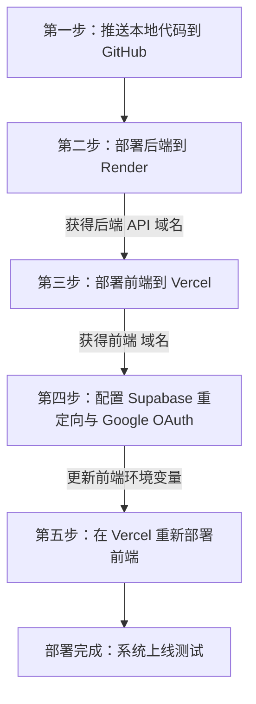

# 🚀 Malaysia Ez Rent - Vercel & Render 完整部署教程

本教程将手把手带您将 **Malaysia Ez Rent** 项目部署到云端。
我们将前端部署到 **Vercel**（免费），后端 API 部署到 **Render**（免费），数据库则继续使用已在运行的 **Supabase**。

---

## 📌 整体部署流程图



---

## 🛠️ 第一步：将本地项目推送到 GitHub

您的项目是一个包含前端和后端的单仓库（Monorepo），根目录下有 `frontend` 和 `backend` 两个子目录。您需要将**整个根目录**推送到 GitHub。

1. **初始化并提交本地代码**：
   打开您的命令行工具（Powershell 或 Git Bash），在项目根目录 `c:\Users\Administrator\Desktop\Malaysia_Ez_rent` 执行：
   ```bash
   git init
   git add .
   git commit -m "feat: ready for cloud deployment"
   ```

2. **在 GitHub 创建新仓库**：
   * 打开 [GitHub](https://github.com/)，登录您的账号。
   * 点击右上角的 **New repository**。
   * 输入项目名称（例如 `Malaysia_Ez_rent`），选择 **Public** 或 **Private**（都可以），**不要**勾选 "Add a README" 等初始化选项。
   * 点击 **Create repository**。

3. **关联远程仓库并推送**：
   按照 GitHub 页面上的提示，运行以下命令（请将 `您的用户名` 替换为实际的 GitHub 用户名）：
   ```bash
   git remote add origin https://github.com/您的用户名/Malaysia_Ez_rent.git
   git branch -M main
   git push -u origin main
   ```

---

## ☁️ 第二步：部署后端到 Render (FastAPI)

我们先部署后端，因为前端在编译时或运行时需要连接后端的真实 API 地址。

1. **注册并登录 Render**：
   * 打开 [Render 官网](https://render.com/)。
   * 点击 **Sign Up** 注册，强烈建议选择 **Continue with GitHub** 直接关联您的 GitHub 账号。

2. **创建 Web Service**：
   * 在 Render 控制台，点击右上角的 **New +** 按钮，选择 **Web Service**。
   * 选择 **Build and deploy from a Git repository**，然后找到您刚刚推送的 `Malaysia_Ez_rent` 仓库，点击 **Connect**。

3. **配置部署参数**：
   在配置页面中，请按照以下内容填写：

   | 配置项 | 填写内容 | 说明 |
   | :--- | :--- | :--- |
   | **Name** | `ezrent-backend` | 服务的名称，会决定您最后的域名 |
   | **Region** | `Singapore` (新加坡) | 离马来西亚最近，网络延迟最低 |
   | **Branch** | `main` | 部署的分支 |
   | **Root Directory** | `backend` | **非常关键**！这里必须填 `backend`，Render 才能进入正确的子文件夹构建 |
   | **Runtime** | `Python 3` | 后端运行语言环境 |
   | **Build Command** | `pip install -r requirements.txt` | 安装依赖包 |
   | **Start Command** | `uvicorn app.main:app --host 0.0.0.0 --port $PORT` | 启动 FastAPI 服务的生产命令 |
   | **Instance Type** | `Free` | 免费计划 |

4. **配置环境变量**：
   展开下面的 **Advanced** (高级设置) 或进入 **Environment** 选项卡，点击 **Add Environment Variable**，逐个添加以下键值对：

   | 键名 (Key) | 值 (Value) | 说明 |
   | :--- | :--- | :--- |
   | `PYTHON_VERSION` | `3.10` | 强制使用 3.10 版本，防止依赖库不兼容 |
   | `OPENAI_API_KEY` | `sk-...` | 您的 SiliconFlow 或 OpenAI 秘钥 |
   | `OPENAI_API_BASE` | `https://api.siliconflow.cn/v1` | 兼容 OpenAI 格式的 SiliconFlow API 端点 |
   | `NEXT_PUBLIC_AGENT_MODEL` | `deepseek-ai/DeepSeek-V3` | 后端使用的 LLM 模型名称 |
   | `TAVILY_API_KEY` | `tvly-...` | 联网搜索 API 密钥（Agent 实时搜索用） |
   | `GOOGLE_MAPS_API_KEY` | `AIzaSy...` | Google 地图 API Key（用于通勤时间估算） |
   | `NEXT_PUBLIC_SUPABASE_URL` | `https://legiyebykxmztaewlmhv.supabase.co` | 您的 Supabase 云端数据库地址 |
   | `NEXT_PUBLIC_SUPABASE_ANON_KEY` | `sb_publishable_...` | Supabase 公开 Anon Key |

5. **生成并等待构建**：
   * 点击页面最下方的 **Create Web Service**。
   * 等待 2-3 分钟，查看控制台日志。当看到 `Your service is live.` 时，说明后端部署成功。
   * **记录您的后端域名**：在 Render 控制台页面左上角，您会看到一个类似于 `https://ezrent-backend.onrender.com` 的链接，拷贝它，下一步会用到。

---

## ⚡ 第三步：部署前端到 Vercel (Next.js)

1. **注册与计划选择**：
   * 打开 [Vercel 官网](https://vercel.com/)。
   * 点击 **Sign Up** 注册，选择 **Continue with GitHub**。
   * 在接下来的 **Choose a Plan** 界面：
     * **选择项目类型**：勾选 **I'm working on personal projects (Hobby)**（个人免费计划）。
     * **Your Name**：输入您的名字（例如 `Chris Feng`）。
     * **Team URL**：使用默认推荐名字（如 `chris-feng-s-projects1`），如果红字报错被占用，可以任意修改成唯一的英文字符。
     * 点击 **Continue** 进入控制台。

2. **导入项目**：
   * 在控制台点击 **Add New...** -> **Project**。
   * 在 Git 列表中找到您的 `Malaysia_Ez_rent` 仓库，点击 **Import**。

3. **配置项目参数 (至关重要)**：
   在 **Configure Project** 页面，展开相关的折叠栏：
   * **Framework Preset**: 保持默认的 `Next.js`。
   * **Root Directory**: **点击 Edit，选择 `frontend` 子目录**。如果不选，Vercel 会因为在根目录下找不到 `package.json` 而报错。
   * **Build and Output Settings**: 保持默认。

4. **配置前端环境变量**：
   在 **Environment Variables** 区域，逐个添加以下变量：

   | 键名 (Key) | 值 (Value) | 说明 |
   | :--- | :--- | :--- |
   | `NEXT_PUBLIC_SUPABASE_URL` | `https://legiyebykxmztaewlmhv.supabase.co` | 您的 Supabase 云端数据库地址 |
   | `NEXT_PUBLIC_SUPABASE_PUBLISHABLE_KEY` | `sb_publishable_...` | Supabase Anon Key |
   | `NEXT_PUBLIC_SUPABASE_ANON_KEY` | `sb_publishable_...` | Supabase Anon Key |
   | `NEXT_PUBLIC_AGENT_API_URL` | `https://ezrent-backend.onrender.com` | **您在第二步中获取到的 Render 后端域名** |
   | `NEXT_PUBLIC_AGENT_MODEL` | `deepseek-ai/DeepSeek-V3` | 前端渲染模型指定 |
   | `NEXT_PUBLIC_GOOGLE_MAPS_API_KEY` | `AIzaSy...` | 前端地图引用的 Google Maps Key |

5. **编译部署**：
   * 点击 **Deploy**。
   * Vercel 会拉取 `frontend` 中的依赖并进行打包编译。
   * 编译完成后，您会获得一个前端访问域名，形如：`https://malaysia-ez-rent.vercel.app`。

---

## 🔒 第四步：更新 Supabase 和 Google 授权配置

为了使系统中的 **Google 登录** 和 **Magic Link 邮箱登录** 在云端正常工作，必须把新域名加到第三方白名单中。

### 1. 更新 Supabase 认证重定向
* 登录 [Supabase 控制台](https://supabase.com/)。
* 找到您的项目，点击左侧菜单的 **Authentication** (身份认证) -> **URL Configuration** (URL配置)。
* **Site URL**：将其更改为您的 Vercel 前端域名，例如 `https://malaysia-ez-rent.vercel.app`。
* **Redirect URLs**：点击 **Add URL**，添加带有回调路径 of 地址，例如 `https://malaysia-ez-rent.vercel.app/auth/callback`。
* 点击 **Save** 保存。

### 2. 更新 Google Cloud OAuth 凭据
* 登录 [Google Cloud Console](https://console.cloud.google.com/)。
* 在顶部选择您的项目，进入 **APIs & Services** -> **Credentials**。
* 点击编辑您为该项目创建的 **OAuth 2.0 Web Client**。
* **Authorized JavaScript origins**（授权的 JavaScript 来源）：
  * 添加一行您的 Vercel 域名：`https://malaysia-ez-rent.vercel.app`。
* **Authorized redirect URIs**（授权的重定向 URI）：
  * **不需要修改**。这里应该依然保持为 Supabase 的官方回调地址（例如 `https://legiyebykxmztaewlmhv.supabase.co/auth/v1/callback`）。
* 点击 **Save** 保存。

---

## 🔁 第五步：验证与排查

1. **测试连接**：
   * 打开您的 Vercel 前端网站。
   * 尝试使用 Google 账户登录或输入邮箱发送登录邮件。如果登录成功并成功跳转回首页，说明认证流程配置无误。
   * 在 **AI Chat** 聊天框中发送一条消息。如果能看到 ReAct 思维链逐步输出并给出流式回答，说明前端已经成功连通了 Render 后端。

2. **Render 免费版的“休眠”特性说明**：
   Render 的免费服务在 **15分钟无流量** 时会自动进入休眠。当再次有人访问时，服务大约需要 **30-50秒** 进行冷启动重新唤醒。
   * **解决方法**：注册一个免费的 [UptimeRobot](https://uptimerobot.com/) 服务，创建一个 HTTP 监控，每 10 分钟检测一次 `https://你的后端.onrender.com/`，即可保持后端服务处于长活状态。

---
*祝您部署顺利！如在部署中遇到问题，可随时将报错截图发送给 AI 助手进行排查。*
